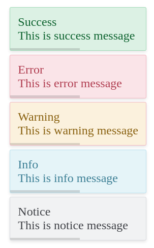

# Notify #

Introducing a lightweight and versatile JavaScript library that seamlessly integrates informative popup messages into
your web applications. Built with efficiency and flexibility in mind

### How do I get set up?  ###

* Enjoy immediate integration without external dependencies: (For simple html website)
    * ```<link href="css/notify.css" rel="stylesheet">```
    * ```<script src="js/notify.js" type="module"></script>```
    * ```javascript 
      <script type="module">
        // important to import first before use anywhere in project
        import {Notify} from './notify.js'
        const notify = new Notify()
      
        // uses
        notify.show('success', 'This is success message')
      </script>
      ```
* For `Node` Based applications like react, view and so.
    * ```npm i @deviser/notify```
* Configuration
    * In Your js file setup notify
      ```javascript
      let notify = new Notify(config)
      ```
    * Experience effortless customization using `config`
      ```javascript
        let config = {
            title: false
        }
      ```
    * Embrace a user-centric approach to communication:
      ```
        | Option  | type    | Default      | Description                                                                                                              |
        |---------|---------|--------------|--------------------------------------------------------------------------------------------------------------------------|
        | title   | boolean | True         | This will be a default title based on notification. you can remove it by setting option to false                         |
        | icon    | boolean | True         | This will be a default icon based on notification. you can remove it by setting option to false                          |
        | type    | string  | info         | you can use type options to display different notification.                                                              |
        | html    | string  | default-html | This will be custom html for your notification you need to add a class ```notify__message``` in your html do add message |
        | timeout | int     | 4000         | This is be timeout for notification to disappear                                                                         |
        | position| string  | top-right    | The position of the notificatino where it will appears                                                                   |
      ```
    * Options (`type`): You can use any of the option from array to display a specific type of notifications
      ```
      'danger': ['danger', 'error'],
      'info': ['information', 'info', 'message'],
      'success': ['success'],
      'warning': ['warning'],
      'notice': ['notice']
      ```
* Display Message `notify.show(type, message)`
    * Examples:
      ```javascript
      notify.show('danger','This is error message')
      notify.show('success', 'This is success message')
      notify.show('error', 'This is error message')
      notify.show('warning', 'This is warning message')
      notify.show('info', 'This is info message')
      notify.show('notice', 'This is notice message')
      ```
      

    * To change html to custom you need some classes for div to interact with notify, you can optionality use these but
      for message, class is required to display notify message
      ```
      Uses:                   Class Name
      For Message             notify__message         This will be your notify message
      For Icon                notify__icon            This will be defualt icon based on type
      For Title               notify__title           This will be default title based on type
      ```

* There is no dependency unless you need to customize your custom html in notify (required css only dependency)

### Contribution guidelines ###

* If you wish to update any info or need to change readme please feel free to raise PR
* Once review, it will be updated.

### Who do I talk to? ###

* Repo owner or admin
* Other community or team contact